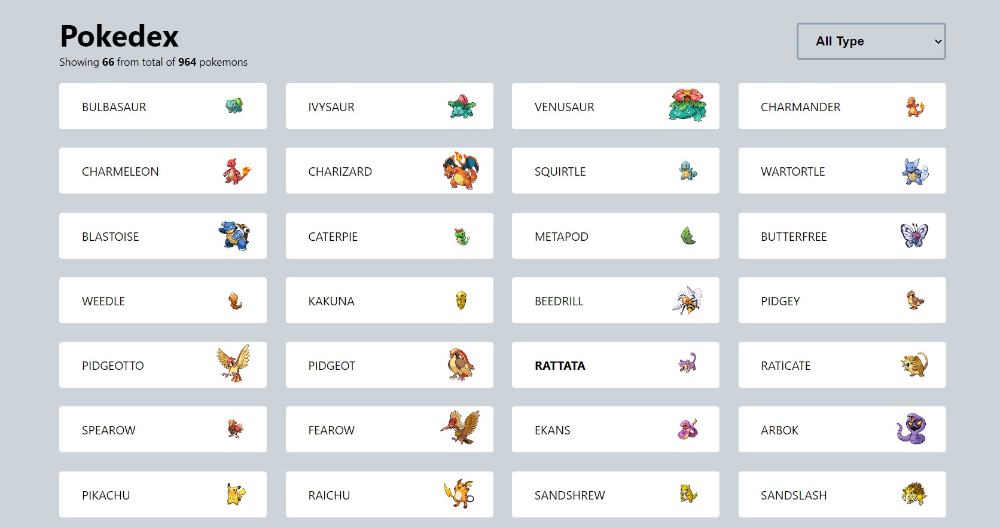

# Pokedex

Simple pokedex, showing list of pokemons and litle stats.

### Browser support

Can only run in modern browsers since it uses `IntersectionObserver`, grid layout, etc.

## Development

### Prerequisites

* NodeJS version 8 or higher

### Runbook

* Run `yarn`
* Run `yarn dev`

## Build

### Runbook

* Run `yarn build`
* Push to repo
* GH page will automatically updated
